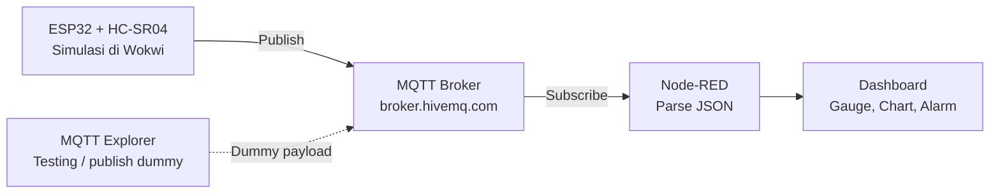

# Tank Level Monitoring System (IoT Simulation)

## Problem Statement
Monitoring level tangki secara manual di lapangan rawan human error dan
delay deteksi kondisi kritis (level terlalu rendah/tinggi). Project ini
mensimulasikan sistem monitoring real-time berbasis IoT.

## Tech Stack
- ESP32 (simulasi via Wokwi) + sensor ultrasonic HC-SR04
- Protokol MQTT (HiveMQ public broker)
- Node-RED sebagai middleware & dashboard
- (Next: InfluxDB + Grafana untuk historical data & OEE-style reporting)

## Architecture
# Arsitektur — Tank Level Monitoring System

## Keterangan alur

1. **ESP32 + HC-SR04** — membaca jarak sensor ultrasonic, dikonversi jadi level persentase tangki, disimulasikan di Wokwi
2. **MQTT Broker** — broker publik (`broker.hivemq.com`, port 1883) sebagai perantara pesan
3. **Node-RED** — subscribe ke topic MQTT, parsing JSON, memproses logika alarm
4. **Dashboard** — visualisasi real-time berupa gauge, chart historis, dan notifikasi alarm level rendah
5. **MQTT Explorer** — tools testing untuk publish payload dummy secara manual, berguna saat Wokwi/ESP32 belum bisa dijalankan

## Tech stack

| Layer | Tool |
|---|---|
| Device | ESP32 (Wokwi simulation) |
| Sensor | HC-SR04 Ultrasonic |
| Protokol | MQTT |
| Middleware | Node-RED |
| Visualisasi | Node-RED Dashboard |

## Demo

Live simulation: https://wokwi.com/projects/469486057453282305

## How to Run
1. Buka link Wokwi, klik Run
2. Import `node-red-flow/flow.json` ke Node-RED
3. Deploy, buka http://localhost:1880/ui

## Future Improvements
- Ganti broker publik dengan private/self-hosted (security)
- Tambah multi-tank monitoring
- Integrasi historical data storage (InfluxDB) + Grafana dashboard
- Tambah notifikasi ke Telegram/WhatsApp saat alarm